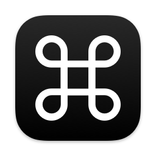

# CommandSource

macOSのコマンドキー（⌘）を、英数キー・かなキーとしても使えるようにするユーティリティです。

コマンドキーを単独で押した際、

- 左コマンドキー: 英数キー
- 右コマンドキー: かなキー

のキーイベントを発生させます。

## 対応バージョン

macOS 13.0（Ventura）以降。

## 使い方

アプリケーションを起動させておくだけです。起動中はステータスバーに「⌘」アイコンが表示されます。アプリケーションの終了はこのアイコンから行うことができます。

## インストール

まず、GitHubの[リリースページ]から`CommandSource.dmg`をダウンロードします。

[リリースページ]: https://github.com/publictheta/CommandSource/releases/latest

次に、`CommandSource.dmg`を開いて、その中にある`CommandSource.app`を`アプリケーション`フォルダに追加します。

最後に、システム環境設定の「プライバシーとセキュリティ」に移動し、

- 「アクセシビリティ」

に`CommandSource.app`を追加します。

うまく動作しない場合、「プライバシーとセキュリティ」の

- 「入力監視」

にも`CommandSource.app`を追加してください。

ダウンロードされるアプリケーションは署名されていません。初回の起動時に、警告メッセージが表示され開けない場合は、Appleヘルプの「[MacでAppを安全に開く]」等を参考に起動してください。

[MacでAppを安全に開く]: https://support.apple.com/ja-jp/HT202491

## アンインストール

`CommandSource.app`をゴミ箱に入れてください。

システム環境設定の「プライバシーとセキュリティ」や「ログイン項目」に`CommandSource.app`が残っている場合、これも削除します。

## 仕組み

[`CGEvent`]の[`tapCreate`]メソッドを使ってキーイベントのストリームに割り込み、コマンドキー単体で閾値以下のあいだ押下されたとき、キーの左右に応じて英数キーまたはかなキーのキーコードを、送出しています。

[`CGEvent`]: https://developer.apple.com/documentation/coregraphics/cgevent
[`tapCreate`]: https://developer.apple.com/documentation/coregraphics/cgevent/1454426-tapcreate

この方法を含む、macOSにおけるイベント監視の様々な方法については、[Karabiner-Elements]の作者である[@tekezo]氏による[macOS native]における発表スライド「[All about macOS event observation]」にコンパクトにまとめられており、このアプリの実装の際に参考にさせていただきました。

[Karabiner-Elements]: https://github.com/pqrs-org/Karabiner-Elements
[@tekezo]: https://github.com/tekezo
[macOS native]: https://macos-native.github.io
[All about macOS event observation]: https://docs.google.com/presentation/d/1nEaiPUduh1vjks0rDVRTcJaEULbSWWh1tVdG2HF_XSU

## バグの報告

GitHubのイシューにお寄せください。ただし、必ずしも対応できるとは限りません。あらかじめご了承ください。

## ライセンス

- MIT License
   ([LICENSE-MIT](LICENSE-MIT) or http://opensource.org/licenses/MIT)
- Apache License, Version 2.0
   ([LICENSE-APACHE](LICENSE-APACHE) or http://www.apache.org/licenses/LICENSE-2.0)

のデュアルライセンスにて提供されます。お好きな方を選んでお使いください。
